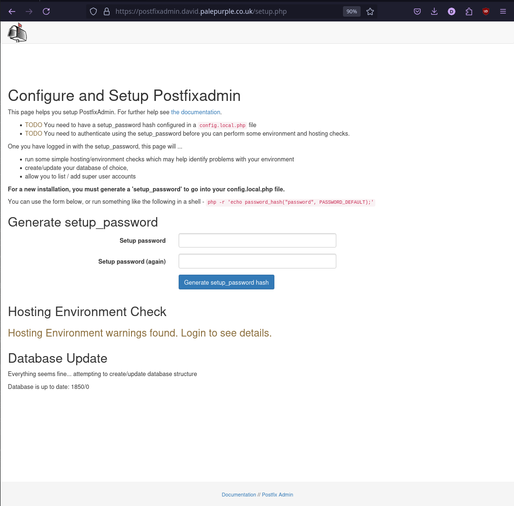

# Some screenshots of Postfixadmin 

## 1. Setup process

When you visit visit https://your-site.com/postfixadmin/setup.php you'll see this -

After creating and adding the setup password hash into your config file, and then logging into the setup page with that password, you should see :

If there are any hosting errors, or issues with your environment, they may be listed here. 

Create a new admin account using your setup password .... then you can login as an admin and start creating domains and mailboxes.

## 2. As an Admin user

### Login

### Welcome page

### View other admins

### View domains

### View mailboxes and aliases for domain

### Add mailbox

You can create as many mailboxes as you want ... 

### Add aliases (forwards)

### Add Fetchmail config for mailbox

### Add a Domain Key for use with OpenDKIM

Specify the selector, domain it's for and the public and private keys (PEM encoded).

### Add a Sign Table Entry for use with OpenDKIM

## View Log -&gt;  Entries for domain

PostfixAdmin mains a log of changes that have been applied to a domain's configuration -

## Send Email -&gt; Send Broadcast email

You can email all mailboxes in known domain(s) -

## 3. As a User

### Login

### Welcome page

### Change your mail forward

### Set / Unset autoresponse (Vacation)

### Set / Unset TOTP Password

To help protect your postfixadmin account, you can enable TOTP (aka Google Authenticator etc) to make it harder for a third party to compromise your account.

### I forgot my password

